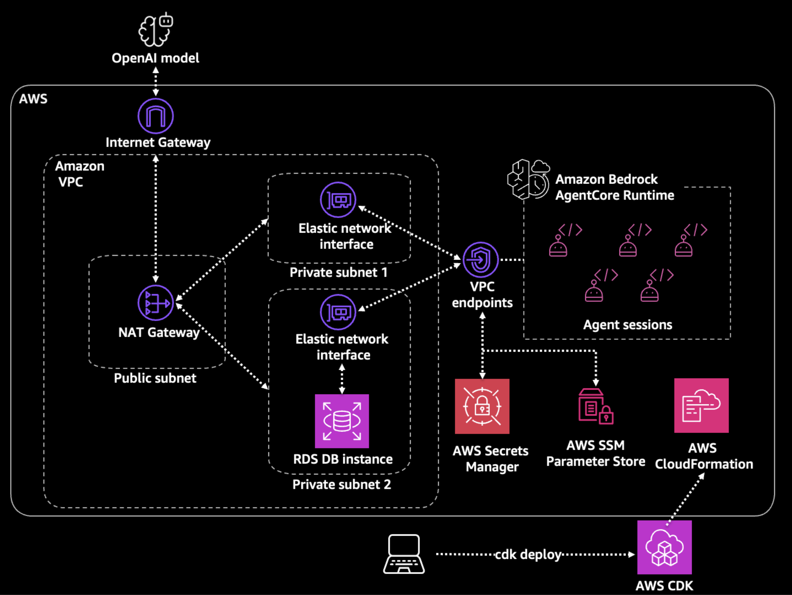

# Deploy an agent with VPC Connectivity using Amazon Bedrock AgentCore Runtime

This sample demonstrates building a logistics tracking agent hosted on Amazon Bedrock AgentCore Runtime with Amazon Virtual Private Cloud (VPC) connectivity. The agent is built using the Strands Agents SDK with an OpenAI model, and the implementation shows how to create an intelligent agent that queries a private Amazon Relational Database Service (RDS) database to track shipments and identify potential delays using local tools. Built with Infrastructure as Code (IaC) using AWS CloudFormation and AWS Cloud Development Kit, this sample provides a complete architecture for deploying agents with secure database connectivity in private networks.

⚠️ DISCLAIMER: This is a sample proof-of-concept (PoC) for demonstration purposes only. It is not suitable for production use and should not be deployed in production environments without significant additional development, testing, and security hardening.

⚠️ DISCLAIMER: This deployment creates AWS resources in your AWS account that will incur charges. Remember to clean up resources directly after you complete the guide to avoid further costs.

## Deployment Overview

This project is deployed in two parts using Infrastructure as Code (IaC):

**Phase 1: Base infrastructure deployment with AWS CloudFormation**

CloudFormation templates (YAML files) are used to deploy the foundational infrastructure:
- Amazon VPC with public and private subnets
- Internet Gateway for internet access
- NAT Gateway for internet access
- Amazon RDS database
- Security groups and route tables
- AWS Secrets Manager secrets for database credentials
- AWS Systems Manager Parameter Store parameters for RDS connection details
- Amazon VPC Endpoints for AWS Secrets Manager, Amazon Bedrock AgentCore Runtime, Amazon CloudWatch Logs, and AWS Systems Manager


**Phase 2: Database seed helper infrastructure deployment with AWS CloudFormation**

CloudFormation templates (YAML files) are used to deploy the infrastructure needed to seed the database:

- Amazon EC2 instance to assist with database setup
- Amazon S3 bucket for file upload
- Security groups
- IAM Role for permissions

**Phase 3: Amazon Bedrock AgentCore Runtime with AWS CDK**

AWS Cloud Development Kit (CDK) is then used to deploy the agent to Amazon Bedrock AgentCore Runtime:
- Amazon Bedrock AgentCore Runtime
- IAM roles and policies
- Agent code packaging script 
- Amazon S3 assets for direct code deployment

**What is the difference between AWS CloudFormation and AWS Cloud Development Kit?** AWS CDK is a higher-level framework that synthesizes CloudFormation templates from code (Python, TypeScript, etc.) when deployed. We use CloudFormation directly for the infrastructure, while CDK is used for the agent deployment because it provides better abstractions for packaging code, managing assets, and handling complex deployment logic. Both ultimately deploy via CloudFormation stacks.

This multi-step approach separates the foundational infrastructure from the agent deployment, making it easier to manage and update each component independently.

## Prerequisites

| Tool | Minimum Version | Purpose |
|------|----------------|---------|
| Python | 3.11+ | Backend development |
| Node.js | 18+ | CDK deployment |
| npm | (included with Node.js) | Package management |
| AWS CLI | 2.x | AWS resource management |
| Docker | 20.x | Container builds |
| Git | Any | Repository cloning |
| pip | Any | package management |

**AWS Requirements:**
- AWS Account with administrator permissions
- OpenAI API Key (get from https://platform.openai.com/account/api-keys) 

## Architecture Overview




## Phase 1: Initial Setup and Infrastructure Deployment

### Step 1.1: Clone Repository and Setup Python Environment

```bash
# Clone the repository (if not already done)
git clone <repository-url>
cd sample-logistics-agent-agentcore-runtime

# Create and activate virtual environment at the root level
python3 -m venv venv
source venv/bin/activate  # On Windows: venv\Scripts\activate

# Install agent dependencies
pip install -r agent/requirements.txt

# Navigate to CDK directory and install CDK dependencies
cd cdk
pip install -r requirements.txt
```

### Step 1.2: Start Docker

Ensure Docker is running:

**macOS/Windows:** Start Docker Desktop application


### Step 1.3: Create OpenAI API Key Secret

If you do not already have an OpenAI key, get your API key from: https://platform.openai.com/account/api-keys

```bash
# Create the secret and capture the ARN
OPENAI_SECRET_ARN=$(aws secretsmanager create-secret \
  --name openai-api-key \
  --secret-string '{"openai-api-key":"sk-your-actual-openai-api-key-here"}' \
  --region us-east-1 \
  --query 'ARN' \
  --output text)

echo "OpenAI Secret ARN: $OPENAI_SECRET_ARN"

# Export for later use
export AGENTCORE_OPENAI_SECRET_ARN=$OPENAI_SECRET_ARN
```

### Step 1.4: Deploy RDS VPC Stack

Navigate to `infrastructure` directory and install CDK dependencies

```bash
cd ../
cd infrastructure
```

Creating the CloudFormation Stack creates the VPC, subnets, VPC endpoints, RDS database, and SSM parameters.

```bash
aws cloudformation create-stack \
  --stack-name rds-vpc-stack \
  --template-body file://rds-vpc-setup.yaml \
  --parameters \
    ParameterKey=DBInstanceClass,ParameterValue=db.t3.micro \
    ParameterKey=DBAllocatedStorage,ParameterValue=20 \
  --capabilities CAPABILITY_NAMED_IAM

# Wait for completion (takes ~10-15 minutes due to RDS creation)
aws cloudformation wait stack-create-complete --stack-name rds-vpc-stack
```

### Step 1.5: Verify Stack Outputs

```bash
aws cloudformation describe-stacks \
  --stack-name rds-vpc-stack \
  --query 'Stacks[0].Outputs' \
  --output table
```

You should see outputs for:
- VPCId
- PrivateSubnet1Id, PrivateSubnet2Id
- RuntimeSecurityGroupId
- RDSEndpoint, RDSPort
- DBSecretArn

## Phase 2: Setup Database Schema and Seed Data

### Step 2.1: Deploy Helper Instance Stack

The `db-setup-helper` stack creates an Amazon EC2 instance to assist with database setup. The instance uses the NAT Gateway from the `rds-vpc-stack` stack for internet access to download packages, and AWS Systems Manager Session Manager for instance access.

```bash
aws cloudformation create-stack \
  --stack-name db-setup-helper \
  --template-body file://db-setup-helper.yaml \
  --parameters ParameterKey=RDSStackName,ParameterValue=rds-vpc-stack \
  --capabilities CAPABILITY_NAMED_IAM

# Wait for completion (takes ~5-7 minutes)
aws cloudformation wait stack-create-complete --stack-name db-setup-helper
```

### Step 2.2: Get Helper Instance Details

```bash
# Get instance ID and bucket name
INSTANCE_ID=$(aws cloudformation describe-stacks \
  --stack-name db-setup-helper \
  --query 'Stacks[0].Outputs[?OutputKey==`InstanceId`].OutputValue' \
  --output text)

BUCKET_NAME=$(aws cloudformation describe-stacks \
  --stack-name db-setup-helper \
  --query 'Stacks[0].Outputs[?OutputKey==`SQLFilesBucketName`].OutputValue' \
  --output text)

echo "Instance ID: $INSTANCE_ID"
echo "Bucket Name: $BUCKET_NAME"
```

### Step 2.3: Upload SQL Files to S3

```bash
# Upload schema and seed data
aws s3 cp schema.sql s3://$BUCKET_NAME/
aws s3 cp seed_data.sql s3://$BUCKET_NAME/

# Verify upload
aws s3 ls s3://$BUCKET_NAME/
```

### Step 2.4: Connect to Helper Instance

Wait 2-3 minutes for the instance to register with SSM, then connect:

```bash
aws ssm start-session --target $INSTANCE_ID
```

### Step 2.5: Setup Database

Once connected to the instance:

```bash
# Install PostgreSQL client and tools
sudo dnf install -y postgresql15 jq

# Download SQL files from S3
BUCKET_NAME=$(aws cloudformation describe-stacks \
  --stack-name db-setup-helper \
  --query 'Stacks[0].Outputs[?OutputKey==`SQLFilesBucketName`].OutputValue' \
  --output text)

mkdir -p /home/ssm-user/db-setup
cd /home/ssm-user/db-setup


aws s3 cp s3://$BUCKET_NAME/schema.sql .
aws s3 cp s3://$BUCKET_NAME/seed_data.sql .

# Get database credentials
DB_SECRET_ARN=$(aws ssm get-parameter \
  --name /agentcore/rds/secret-arn \
  --query 'Parameter.Value' \
  --output text)

DB_ENDPOINT=$(aws ssm get-parameter \
  --name /agentcore/rds/endpoint \
  --query 'Parameter.Value' \
  --output text)

DB_CREDENTIALS=$(aws secretsmanager get-secret-value \
  --secret-id $DB_SECRET_ARN \
  --query 'SecretString' \
  --output text)

DB_USERNAME=$(echo $DB_CREDENTIALS | jq -r '.username')
DB_PASSWORD=$(echo $DB_CREDENTIALS | jq -r '.password')

# Apply schema
PGPASSWORD=$DB_PASSWORD psql \
  -h $DB_ENDPOINT \
  -U $DB_USERNAME \
  -d company_logistics_db \
  -f schema.sql

# Apply seed data
PGPASSWORD=$DB_PASSWORD psql \
  -h $DB_ENDPOINT \
  -U $DB_USERNAME \
  -d company_logistics_db \
  -f seed_data.sql

# Verify tables were created
PGPASSWORD=$DB_PASSWORD psql -h $DB_ENDPOINT -U $DB_USERNAME -d company_logistics_db -c "\dt logistics.*"

# Verify data was populated
PGPASSWORD=$DB_PASSWORD psql -h $DB_ENDPOINT -U $DB_USERNAME -d company_logistics_db -c "SELECT * FROM logistics.shipments LIMIT 1;"


# Exit the session
exit
```

### Step 2.6: Delete Helper Stack 

Now that the database is seeded, delete the helper stack:

```bash
# Exit back to your local terminal (if still in SSM session)
# Then navigate to infrastructure directory
cd ../../infrastructure


BUCKET_NAME=$(aws cloudformation describe-stacks \
  --stack-name db-setup-helper \
  --query 'Stacks[0].Outputs[?OutputKey==`SQLFilesBucketName`].OutputValue' \
  --output text)

echo "Emptying bucket: $BUCKET_NAME"

# Delete all versions and delete markers using batch delete
aws s3api delete-objects \
  --bucket $BUCKET_NAME \
  --delete "$(aws s3api list-object-versions \
    --bucket $BUCKET_NAME \
    --output json \
    --query '{Objects: Versions[].{Key:Key,VersionId:VersionId}}')" \
  2>/dev/null || echo "No versions to delete"

aws s3api delete-objects \
  --bucket $BUCKET_NAME \
  --delete "$(aws s3api list-object-versions \
    --bucket $BUCKET_NAME \
    --output json \
    --query '{Objects: DeleteMarkers[].{Key:Key,VersionId:VersionId}}')" \
  2>/dev/null || echo "No delete markers to delete"

# Verify bucket is empty
echo "Verifying bucket is empty..."
aws s3 ls s3://$BUCKET_NAME/ 2>/dev/null || echo "✓ Bucket is empty"

# Delete the helper stack
aws cloudformation delete-stack --stack-name db-setup-helper

# Wait for deletion to complete (optional)
aws cloudformation wait stack-delete-complete --stack-name db-setup-helper
```

## Phase 3: Deploy AgentCore Runtime

### Step 3.1: Export Infrastructure Values

Export the values from the RDS stack for CDK:

```bash
cd ../
cd cdk

# Export required environment variables
export CDK_DEFAULT_ACCOUNT=$(aws sts get-caller-identity --query Account --output text)
export CDK_DEFAULT_REGION="us-east-1"

# Export environment variables for create_zip.py script
export BUNDLE_DIR="/tmp/agent-bundle"
export OUTPUT_ZIP="/asset-output/agent-code.zip"

# Export OpenAI secret ARN (if not already set from Step 1.5)
if [ -z "$AGENTCORE_OPENAI_SECRET_ARN" ]; then
  export AGENTCORE_OPENAI_SECRET_ARN=$(aws secretsmanager describe-secret \
    --secret-id openai-api-key \
    --query 'ARN' \
    --output text 2>/dev/null || echo "arn:aws:secretsmanager:us-east-1:${CDK_DEFAULT_ACCOUNT}:secret:openai-api-key-XXXXXX")
fi

export AGENTCORE_VPC_ID=$(aws cloudformation describe-stacks \
  --stack-name rds-vpc-stack \
  --query 'Stacks[0].Outputs[?OutputKey==`VPCId`].OutputValue' \
  --output text)

export AGENTCORE_SUBNET_1=$(aws cloudformation describe-stacks \
  --stack-name rds-vpc-stack \
  --query 'Stacks[0].Outputs[?OutputKey==`PrivateSubnet1Id`].OutputValue' \
  --output text)

export AGENTCORE_SUBNET_2=$(aws cloudformation describe-stacks \
  --stack-name rds-vpc-stack \
  --query 'Stacks[0].Outputs[?OutputKey==`PrivateSubnet2Id`].OutputValue' \
  --output text)

export AGENTCORE_RUNTIME_SG_ID=$(aws cloudformation describe-stacks \
  --stack-name rds-vpc-stack \
  --query 'Stacks[0].Outputs[?OutputKey==`RuntimeSecurityGroupId`].OutputValue' \
  --output text)

export AGENTCORE_DB_SECRET_ARN=$(aws cloudformation describe-stacks \
  --stack-name rds-vpc-stack \
  --query 'Stacks[0].Outputs[?OutputKey==`DBSecretArn`].OutputValue' \
  --output text)

# Verify all variables are set
echo "VPC ID: $AGENTCORE_VPC_ID"
echo "Subnet 1: $AGENTCORE_SUBNET_1"
echo "Subnet 2: $AGENTCORE_SUBNET_2"
echo "Security Group: $AGENTCORE_RUNTIME_SG_ID"
echo "DB Secret ARN: $AGENTCORE_DB_SECRET_ARN"
echo "OpenAI Secret ARN: $AGENTCORE_OPENAI_SECRET_ARN"
```

### Step 3.2: Bootstrap CDK (First-Time Setup)

CDK requires a one-time bootstrap process to create the CDKToolkit stack with resources needed for deployments:

```bash
# Bootstrap CDK in your account/region (creates CDKToolkit stack)
cdk bootstrap aws://$CDK_DEFAULT_ACCOUNT/$CDK_DEFAULT_REGION
```

**Expected Output:**
```
✅  Environment aws://123456789012/us-east-1 bootstrapped.
```

This creates the `CDKToolkit` CloudFormation stack containing:
- S3 bucket for storing deployment assets
- IAM roles for CDK deployments
- ECR repository for container images

**Note**: Bootstrap is only needed once per account/region combination. If you see "CDKToolkit" stack already exists, you can skip this step.

### Step 3.3: Deploy AgentCore Runtime

Ensure Docker is running, then:

```bash
cdk deploy
```

When prompted `Do you wish to deploy these changes (y/n)?` type `y`.

### Step 3.4: Get Runtime ARN and Export for Testing

```bash
# Get and export the runtime ARN for use in testing
export AGENT_RUNTIME_ARN=$(aws cloudformation describe-stacks \
  --stack-name LogisticsAgentRuntimeStack \
  --query 'Stacks[0].Outputs[?OutputKey==`RuntimeArn`].OutputValue' \
  --output text)

echo "Runtime ARN: $AGENT_RUNTIME_ARN"
```

## Phase 4: Test the Agent

### Step 4.1: Invoke the Agent

**Option A: Using Python (Recommended)**

There is a file called `invoke_agent.py` that invokes the agent. Run it:

```bash
python3 invoke_agent.py
```

**Important Notes:**
- **Session IDs should be unique** when testing code changes. The session remains active until it times out (15 minute default timeout) so if you deploy a new version with a code change you need to start a new session to hit the new version using the DEFAULT endpoint.
- Session IDs must be at least 33 characters long

## Cleanup

To remove all resources:

```bash
# Delete CDK stack
cd sample-logistics-agent-agentcore-runtime/cdk
cdk destroy
```


When prompted `Are you sure you want to delete: LogisticsAgentRuntimeStack (y/n)?` type `y`.


```bash
# Delete OpenAI secret (force delete without recovery period)
aws secretsmanager delete-secret \
  --secret-id openai-api-key \
  --force-delete-without-recovery \
  --region us-east-1

# Delete RDS VPC stack
cd ../../infrastructure
# Note: May need to wait for ENI cleanup first (see troubleshooting below)
aws cloudformation delete-stack --stack-name rds-vpc-stack
```

**Note**: The helper stack should already be deleted from Step 2.6. If not, delete it first:
```bash
# Only if helper stack still exists
aws cloudformation delete-stack --stack-name db-setup-helper
```

### Troubleshooting Cleanup Issues

If the RDS VPC stack deletion fails subnet or security group deletion, it's likely due to the Bedrock AgentCore ENIs that haven't been cleaned up yet. ENIs timeout after 8 hours, after which the dependent resources can be deleted. Try deleting the stack after waiting for the 8-hour timeout period.

**Option B: Force Delete with Retain**
If you can't wait up to 8 hours, force delete the stack and clean up the remaining resources manually later:
1. Go to CloudFormation Console → rds-vpc-stack → Delete
2. When deletion fails, delete again and check "Retain resources that cannot be deleted"
3. Wait for AWS to clean up the ENIs (up to 8 hours)
4. Manually delete the VPC, subnets, and security groups from EC2 Console


## Security

See [CONTRIBUTING](CONTRIBUTING.md#security-issue-notifications) for more information.

## License

This library is licensed under the MIT-0 License. See the LICENSE file.

